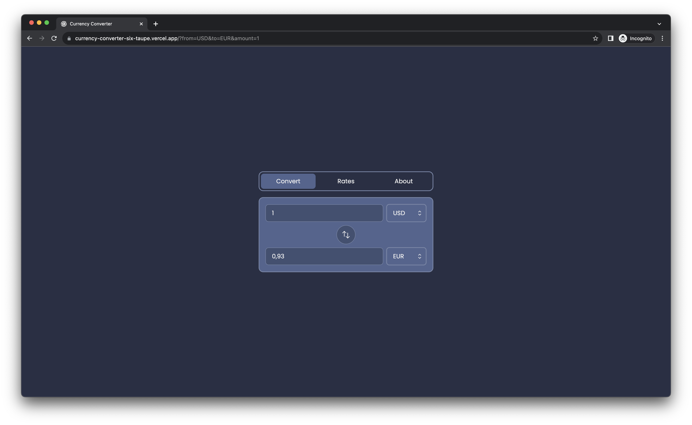

# Currency Converter

Live Site URL: [Currency Converter](https://currency-converter-six-taupe.vercel.app/)

## Table of contents

- [Overview](#overview)
  - [Screenshots](#screenshots)
- [Getting started](#getting-started)
  - [Installation](#installation)
  - [Set up API Key](#set-up-api-key)
  - [Running the App](#running-the-app)
- [Process](#process)
  - [Built with](#built-with)
  - [Resources](#resources)

## Overview

### App features

### Screenshots



## Getting Started

### Installation

1. Clone the repository:

   ```bash
   git clone https://github.com/iva-stasia/currency-converter.git
   ```

2. Navigate to the project directory:

   ```bash
   cd currency-converter
   ```

3. Install dependencies:

   ```bash
   npm install
   ```

### Set up API Key

1. Obtain an API key:

   - Get free api key on [FreecurrencyAPI](https://app.freecurrencyapi.com/)

2. Create a `.env` file in the root directory of your project.

3. Add your API key to the `.env` file:

   ```env
   API_KEY=your_api_key_here
   ```

   Replace `your_api_key_here` with the actual API key you obtained.

   **Note:** Ensure that your `.env` file is listed in your `.gitignore` file to avoid exposing sensitive information.

### Running the App

Now that you have set up the API key, you can run your app:

```bash
npm run dev
```

Open [http://localhost:3000](http://localhost:3000) with your browser to see the result.

## Process

### Built with

- [TypeScript](https://www.typescriptlang.org/)
- [Next.js](https://nextjs.org/)
- [React](https://reactjs.org/)
- [Tailwind](https://tailwindcss.com/)

### Resources

[FreecurrencyAPI](https://app.freecurrencyapi.com/)
